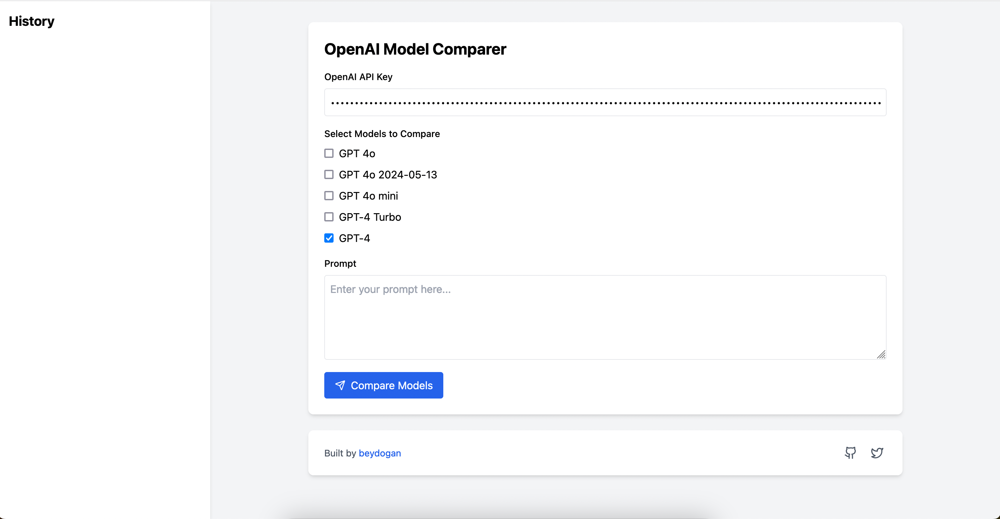

# GPT Model Compare Tool

A simple web application that allows you to compare responses from different OpenAI models side by side. Test your prompts across multiple models to understand how they perform differently.

[Go to the tool](https://beydogan.github.io/gpt-compare-tool/)




## Features

- 🔄 Compare responses from multiple OpenAI models simultaneously
- 🔒 Secure API key handling (stored only in browser's localStorage)
- 📝 Save prompt history for future reference
- 🎨 Clean, responsive UI
- 💾 All data stored locally in your browser
- 🚀 Zero server requirements - runs entirely in the browser

## Getting Started

### Prerequisites

- Node.js (v16 or higher)
- npm or yarn
- OpenAI API key ([Get one here](https://platform.openai.com/api-keys))

### Installation & Running Locally
 
1. Clone the repository:
```bash
git clone https://github.com/beydogan/
cd openai-model-comparer
```

2. Install dependencies:
```bash
npm install
# or
yarn
```

3. Start the development server:
```bash
npm run dev
# or
yarn dev
```

4. Open [http://localhost:3000](http://localhost:3000) in your browser

## Usage

1. Enter your OpenAI API key in the designated field
2. Select the models you want to compare
3. Enter your prompt
4. Click "Compare Models" to see the responses

Your API key and prompt history are stored locally in your browser's localStorage for convenience and privacy.

## Built With

- React
- Tailwind CSS
- Lucide Icons
- OpenAI API

## Privacy & Security

- Your OpenAI API key is stored only in your browser's localStorage
- API requests are made directly to OpenAI from your browser
- No data is transmitted to any third-party servers
- All history and settings are stored locally in your browser

## Contributing

Contributions are welcome! Please feel free to submit a Pull Request.

1. Fork the Project
2. Create your Feature Branch (`git checkout -b feature/AmazingFeature`)
3. Commit your Changes (`git commit -m 'Add some AmazingFeature'`)
4. Push to the Branch (`git push origin feature/AmazingFeature`)
5. Open a Pull Request

## License

This project is licensed under the MIT License - see the [LICENSE](LICENSE) file for details.
